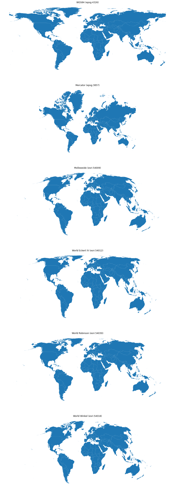

# World Projections in Python

It is not easy to find a single source of world projections and their equivalent CRS codes for mapping in python with geopandas. Here, you can see the various projections and the conversion codes required to change them.

For example, to change a geodataframe from its projection to a World Robinson projection:

`python

import geopandas as gpd

gdf = gdf.to_crs('esri:54030')

`

